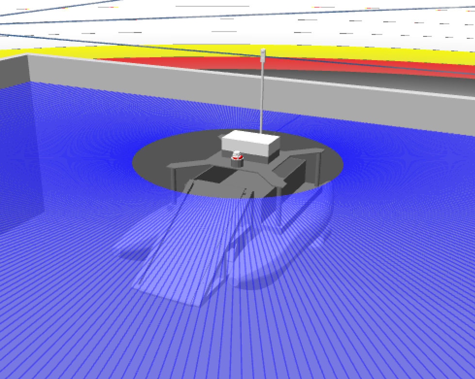
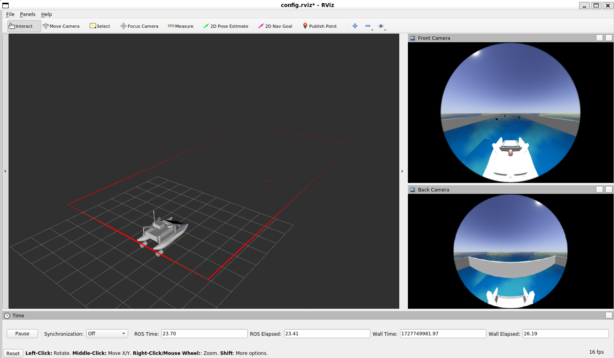
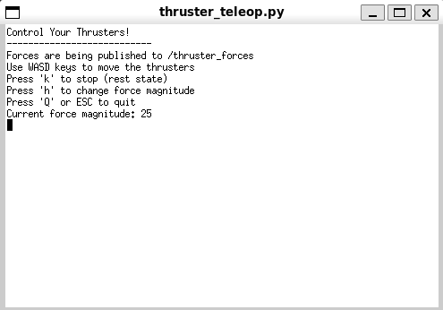
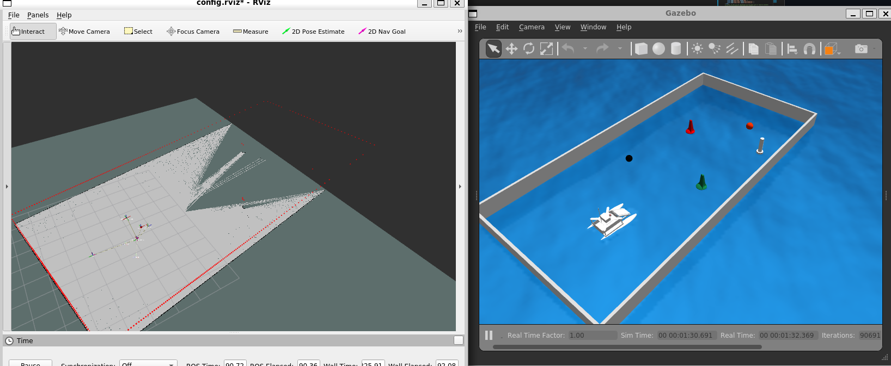
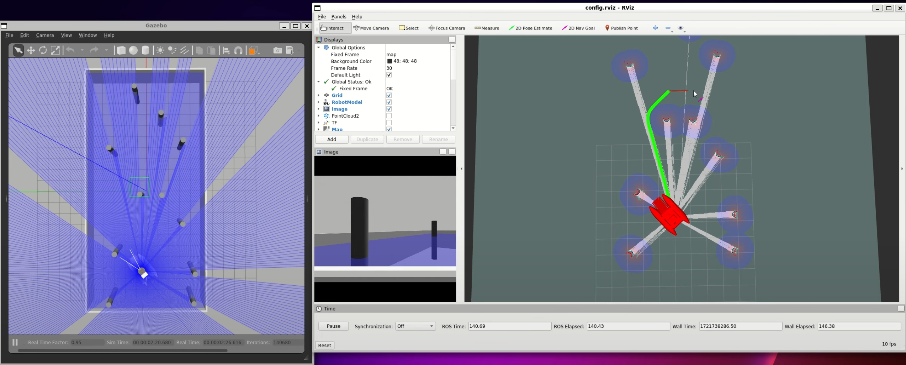

# triton_project
This project provides a ROS-based control system for a simulated catamaran equipped with thrusters. The control system allows you to adjust thruster forces dynamically using keyboard inputs. The simulation includes buoyancy effects using a custom URDF model with Gazebo plugins.

## Installation
Navigate to your workspace and clone into the source folder.
```
cd ~/catkin_ws/src
git clone --recurse-submodules https://github.com/Abanesjo/triton_project
cd ../
```
Then, install necessary dependencies
```
rosdep install --from-paths src --ignore-src -r -y
```
Then build with catkin
```
catkin build
source devel/setup.bash
```

## Usage

To bringup the gazebo simulation, use:
```
roslaunch triton gazebo.launch
```


The robot contains a 360-degree 2D LiDAR.



It also has a 360-degree fisheye camera, mounted atop the rod.


By default, the control interface is also launched, allowing the force on each thrusters to be controlled.


Hector mapping is available, but disabled by default for now since it is still under development. The same is true for the implementation of the <code>move_base</code> package.


## WSL

For those using WSL, there are a few limitations:
- The 360-degree camera are incompatible with the GPU support for WSL, so using the camera will require launching in CPU-only mode. This can be done by going to <code>gazebo.launch</code> and modifying the <code>LIBGL_ALWAYS_SOFTWARE</code> environment.

```
<!-- Set the following to '1' for WSL -->
<env name="LIBGL_ALWAYS_SOFTWARE" value="1"/>
```

## Old Simulation
For documentation purposes, the old simulation used in the Mubadala proposal stage is still available and can be launched using
```
roslaunch triton gazebo_old.launch
```
You can click on the image as well to view the youtube video showcasing the pathfinding algorithm.
[](https://www.youtube.com/watch?v=b8Hz6W0vQY8)

