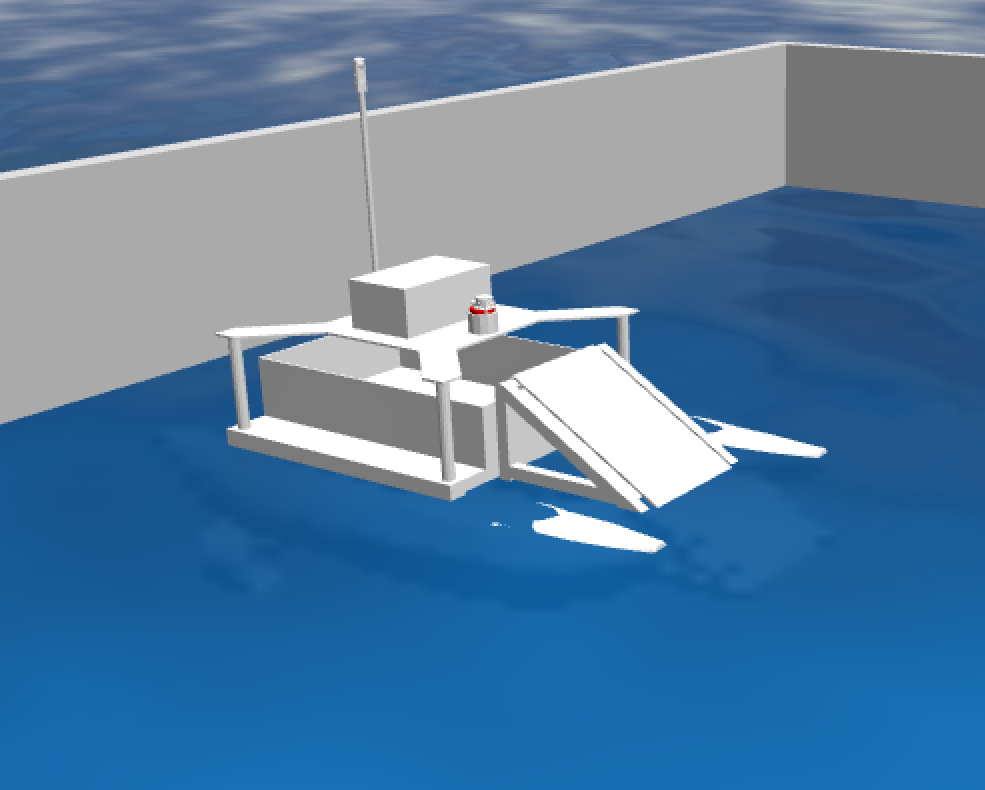

# triton_project
This project provides a ROS-based control system for a simulated catamaran equipped with thrusters. The control system allows you to adjust thruster forces dynamically using keyboard inputs. The simulation includes buoyancy effects using a custom URDF model with Gazebo plugins.

## Installation
Navigate to your workspace and clone into the source folder.
```
cd ~/catkin_ws/src
git clone --recurse-submodules https://github.com/Abanesjo/triton_project
cd ../
```
Then, install necessary dependencies
```
rosdep install --from-paths src --ignore-src -r -y
```
Then build with catkin
```
catkin build
source devel/setup.bash
```

## Usage

To bringup the gazebo simulation, use:
```
roslaunch triton gazebo.launch
```
\* **Note that the simulation starts paused**



### Additional Options

#### RViz
You can bringup the rviz visualization by adding an argument
```
roslaunch triton gazebo.launch rviz:=true
```


#### Thruster Force Teleop
You can control the thrusters using WASD. They subscribe to the <code>/thruster_forces</code> topic by defualt. The Teleop tool lets you publish manually. This is launched with another argument.
```
roslaunch triton gazebo.launch control:=force
```


You can monitor the thruster forces using <code>rostopic</code>


#### Velocity Teleop
Velocity control is also available. It will be less realistic, but will be more predictable and usually has better simulation performance. The robot subscribes to the <code>/velocity</code> topic.
```
roslaunch triton gazebo.launch control:=velocity
```

**Do not use both force and velocity plugins at the same time**

You can launch all the arugments at once
```
roslaunch triton gazebo.launch rviz:=true control:=force
```
or
```
roslaunch triton gazebo.launch rviz:=true control:=velocity
```
